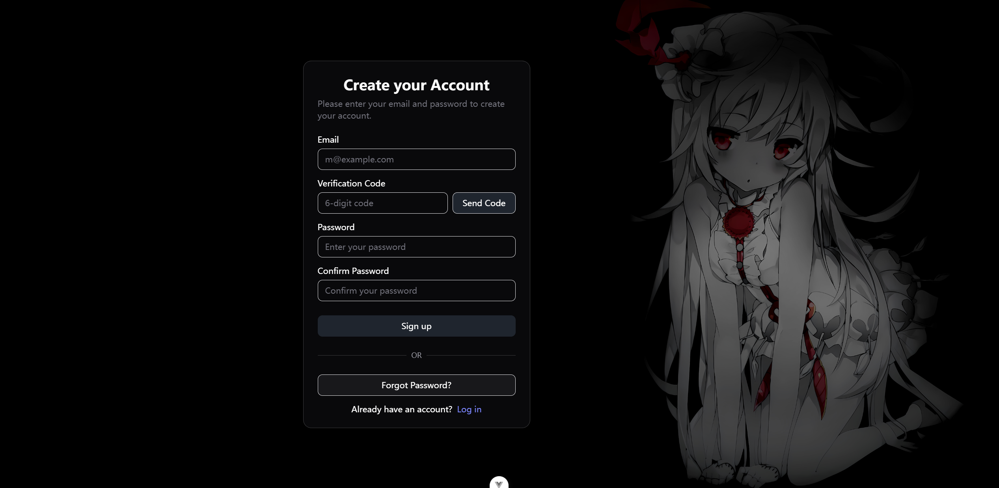

# Vue3-system

The project is a system built with Vue 3. Just used for learning purposes. 

It contains login, register pages and other pages to be developed.

Used the `shadcn-vue` UI.

## Some Pages
**Login**

**Register**


## Project Setup

**Install dependencies:**
Install the required dependencies using npm:
```sh
npm install
```
**Environment Variables:**

Create a `.env.development` file in the root directory and add the following environment variables:

```
# This is the base URL for the API endpoints
VITE_API_BASE_URL=http://localhost:8080/api/v1

# This variable indicates whether the mock user is logged in or not
VITE_MOCK_LOGGED_IN=false
```

**Compile and Hot-Reload for Development:**

```sh
npm run dev
```

**Type-Check, Compile and Minify for Production:**

```sh
npm run build
```
