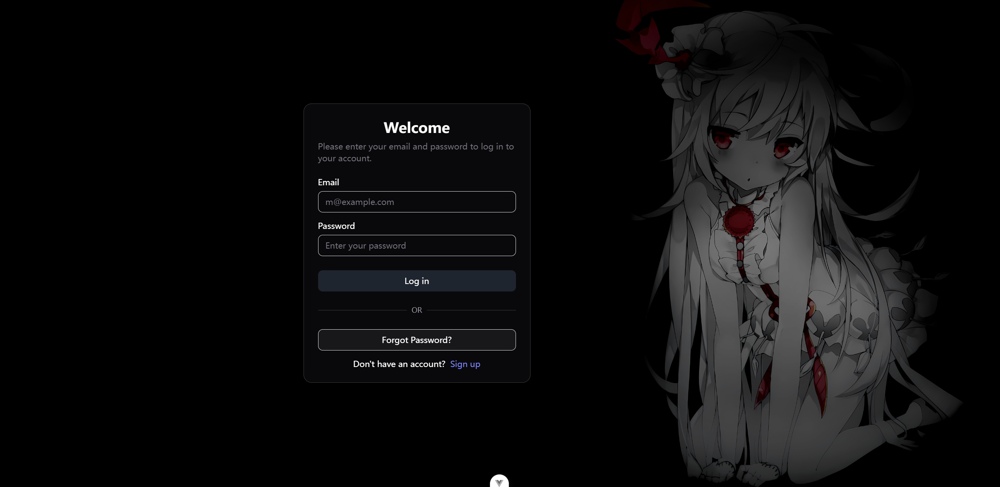

# management-system

The project is a management system built with Vue 3. Just used for learning purposes. 

It contains login, register pages and other pages to be developed.

Used the shadcn-vue UI.

## Some Pages
**Login**

 
## Project Setup

```sh
npm install
```

### Compile and Hot-Reload for Development

```sh
npm run dev
```

### Type-Check, Compile and Minify for Production

```sh
npm run build
```
